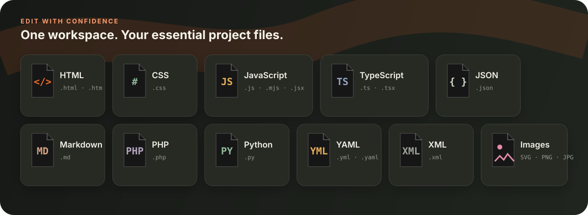

<div align="center">
  
  <h1>CodeSpace</h1>
  <p><strong>A fast, private browser workbench for building web projects.</strong></p>
  <p>Edit multiple files, inspect console output and preview responsive layouts without installing an editor.</p>
  <p>
    <a href="https://kegodev.github.io/kmdlabs-codespace/"><strong>Open the live workbench →</strong></a>
    ·
    <a href="#quick-start">Quick start</a>
    ·
    <a href="CONTRIBUTING.md">Contribute</a>
  </p>
  <p>
    
    
    
  </p>
</div>


## Why CodeSpace

CodeSpace turns a browser tab into a focused front-end lab. It borrows the useful parts of a desktop IDE—an Explorer, tabs, project search, a command palette, keyboard shortcuts and a console—while keeping the setup small enough for a classroom, a quick prototype or a low-spec computer.

The application has no framework or package runtime. Its core HTML, CSS and JavaScript load directly from GitHub Pages, and an offline cache keeps the workbench available after the first successful visit.

### Workbench highlights

| Area | What it gives you |
| --- | --- |
| Editor | Multi-file tabs, line numbers, syntax colour, paired characters, indentation and context suggestions |
| Navigation | Explorer, quick open, filename filter, full-project text search and a command palette |
| Preview | Sandboxed HTML/CSS/JavaScript output with desktop, tablet and mobile viewports |
| Feedback | Captured `log`, `warn`, runtime error and unhandled rejection output |
| Speed | 90 ms run scheduling, in-place CSS hot updates, large-file fallback and no external font request |
| Files | Create, rename, delete, upload, drag and drop, folder upload and active-file download |
| Portability | Export or import the full project as one `.kmdspace` workspace file |
| Persistence | Files, open tabs and workbench preferences are restored from browser storage |
| Mobile | Dedicated Files, Editor and Preview views with touch-friendly controls |
| Offline | Installable Progressive Web App shell cached by a service worker |

## Supported files

<picture>
  
</picture>

HTML, CSS and standard JavaScript run in the live preview. The other visualized formats can be opened and edited; image formats are stored as project assets and shown in the editor preview. CodeSpace intentionally does not pretend to execute server-side languages or transpile JSX/TypeScript in the browser.

## Quick start

1. Open the [live CodeSpace workbench](https://kegodev.github.io/kmdlabs-codespace/).
2. Choose a file in Explorer and start typing. The starter project includes `index.html`, `style.css` and `script.js`.
3. Select **Compile**, or press <kbd>Ctrl/⌘ + Enter</kbd>, to open the preview.
4. Use the device buttons above the preview to check desktop, tablet and mobile layouts.
5. Export a `.kmdspace` file from the command palette when you need a portable backup.

Your project is saved automatically in the current browser. Clearing site data removes that local copy, so export important work before clearing browser storage or changing devices.

### Keyboard workflow

| Shortcut | Action |
| --- | --- |
| <kbd>Ctrl/⌘ + P</kbd> | Quick-open a file |
| <kbd>Ctrl/⌘ + Shift + P</kbd> | Open the command palette |
| <kbd>Ctrl/⌘ + Shift + F</kbd> | Search the project |
| <kbd>Ctrl/⌘ + Enter</kbd> | Compile and open the preview |
| <kbd>Ctrl/⌘ + S</kbd> | Save the workspace immediately |
| <kbd>Ctrl/⌘ + N</kbd> | Create a file |

## Run it locally

No build step is required.

```bash
git clone https://github.com/kegodev/kmdlabs-codespace.git
cd kmdlabs-codespace
python3 -m http.server 8000
```

Then visit `http://localhost:8000`. A local server is recommended because browsers do not enable service workers on `file://` pages.

## How the preview works

```text
Workspace files
    ├── index.html ── parsed as the entry document
    ├── *.css ─────── linked or injected into the document
    ├── *.js ──────── linked or appended in project order
    └── images ────── converted to in-memory data URLs
                         │
                         ▼
                sandboxed iframe preview
                         │
                         ▼
                 console message bridge
```

Local stylesheet, script and image references are resolved inside the virtual project before the result is assigned to `iframe.srcdoc`. Editing an included stylesheet uses an in-place style update; structural HTML or JavaScript changes rebuild the preview document.

## Privacy and safety

- Editing and persistence happen on the device; CodeSpace has no project database or account backend.
- Preview code runs in a sandboxed iframe, separated from the workbench document.
- Console events are accepted only from the active preview frame.
- Imported projects remain local unless the user explicitly downloads or publishes them.

Do not use browser storage as the only copy of important work. CodeSpace is a learning and prototyping environment, not a replacement for Git history, access control or server-side secret management.

## Project structure

```text
.
├── index.html                  # Workbench structure and accessible controls
├── style.css                   # Responsive VS Code-inspired interface
├── script.js                   # Editor, virtual files, search and compiler
├── manifest.webmanifest        # Installable app metadata
├── sw.js                       # Offline application-shell cache
├── favicon.svg                 # Brand/application icon
├── assets/readme/              # README visuals and product screenshot
└── .github/                    # Issue and pull-request templates
```

## Contributing

Focused pull requests are welcome. Good contributions include browser compatibility fixes, editor accessibility, reproducible import/export fixes, performance improvements and documentation examples. Read [CONTRIBUTING.md](CONTRIBUTING.md) before opening a pull request and include the browsers or devices you tested.

## License

Copyright © KM Digital Labs. All rights reserved unless the repository owner supplies a separate written licence.

Public source visibility does not by itself grant permission to copy, redistribute, sublicense or sell this work.
